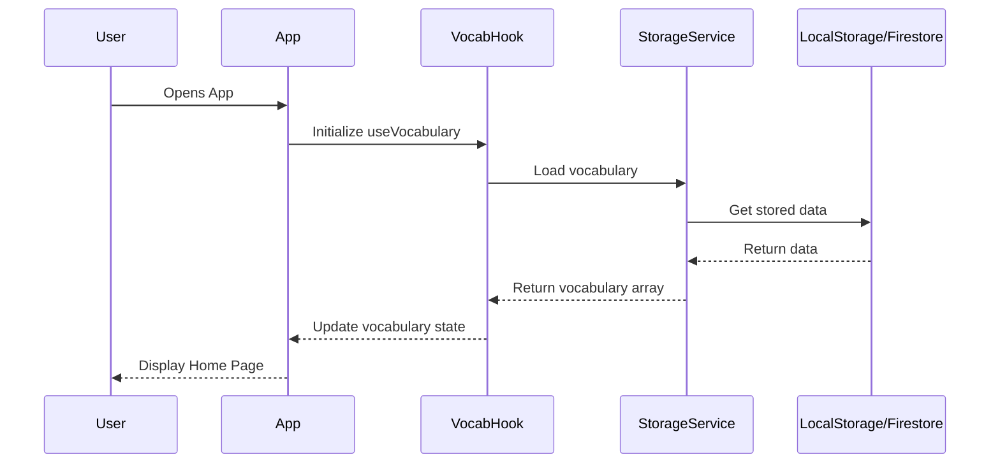
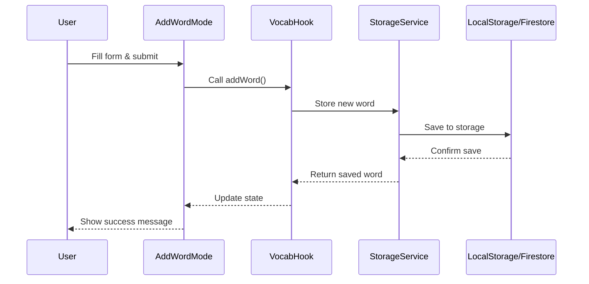
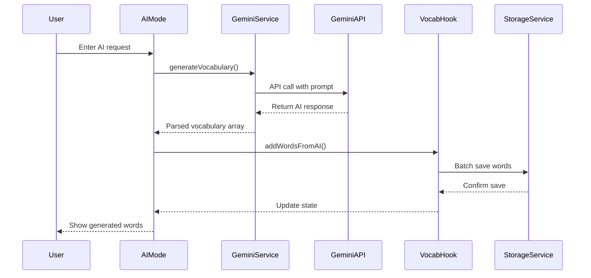
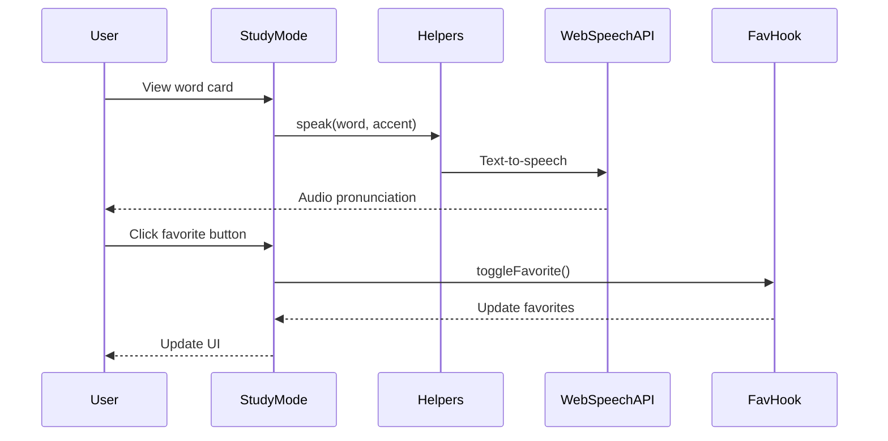
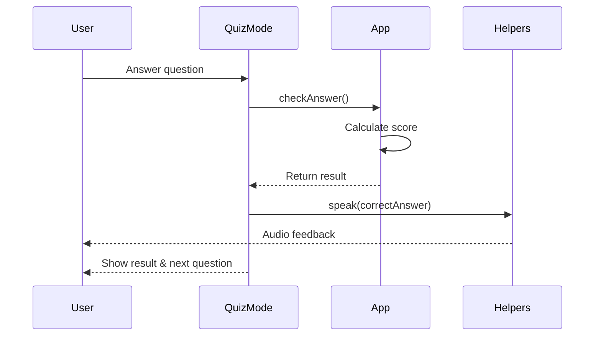
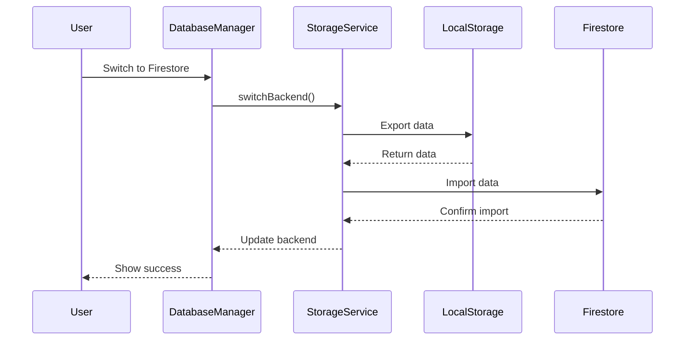
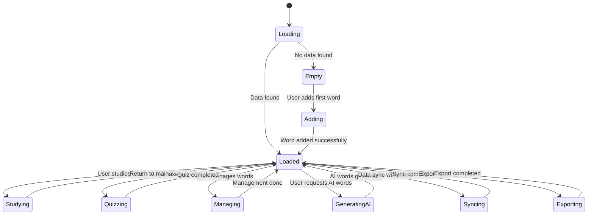

# Class Diagram - Study English Vocabulary App

## Sơ đồ lớp của ứng dụng học từ vựng tiếng Anh với AI

## Mô tả chi tiết các lớp

### 1. **EnglishVocabApp** - Lớp chính
- **Vai trò**: Component gốc của ứng dụng, quản lý state tổng thể
- **Chức năng**: Điều phối tương tác giữa các component con, quản lý routing giữa các mode

### 2. **Custom Hooks**
- **useVocabulary**: Quản lý CRUD operations cho từ vựng
- **useFavorites**: Quản lý danh sách từ yêu thích
- **useApiKey**: Quản lý API key cho Gemini service

### 3. **UI Components**
- **Header**: Thanh tiêu đề với selector giọng đọc
- **ModeSelector**: Navigation tabs giữa các chế độ
- **StudyMode**: Flashcard học từ vựng
- **QuizMode**: Chế độ kiểm tra với quiz
- **AddWordMode**: Form thêm từ vựng mới
- **AIMode**: Interface tương tác với Gemini AI
- **ManageMode**: Quản lý và chỉnh sửa từ vựng
- **HomePage**: Trang chủ với thống kê tổng quan
- **Statistics**: Thống kê chi tiết theo CEFR và category
- **DatabaseManager**: Quản lý database và migration
- **EmptyState**: Hiển thị khi chưa có dữ liệu
- **CategoryOverview**: Tổng quan theo danh mục
- **Footer**: Chân trang

### 4. **Services**
- **GeminiService**: Tương tác với Google Gemini API
- **StorageService**: Abstraction layer cho storage operations
- **FirestoreService**: Implementation cho Firestore
- **SafeStorageService**: Fallback implementation cho localStorage

### 5. **Data Models**
- **VocabularyItem**: Model cho một từ vựng
- **Score**: Model cho điểm quiz
- **Category**: Model cho danh mục từ loại
- **Level**: Model cho cấp độ CEFR

### 6. **Utilities**
- **Helpers**: Utility functions (speak, filter, etc.)
- **StorageHelpers**: Helper functions cho localStorage
- **ApiTest**: Test kết nối API
- **InitialVocabulary**: Dữ liệu khởi tạo

## Luồng dữ liệu chính

1. **App khởi tạo** → useVocabulary → StorageService → Load dữ liệu
2. **User thêm từ** → AddWordMode → useVocabulary → StorageService → Save
3. **AI tạo từ** → AIMode → GeminiService → useVocabulary → StorageService
4. **Học từ vựng** → StudyMode → Helpers.speak() → Web Speech API
5. **Quiz** → QuizMode → Tính điểm → Update Score state
6. **Quản lý** → ManageMode → useVocabulary → CRUD operations

## Patterns sử dụng

- **Custom Hooks Pattern**: Tách logic ra khỏi UI components
- **Service Layer Pattern**: Tách biệt business logic và data access
- **Strategy Pattern**: StorageService có thể switch giữa localStorage và Firestore
- **Observer Pattern**: React hooks để theo dõi state changes
- **Facade Pattern**: StorageService che giấu complexity của storage backends

Sơ đồ này thể hiện kiến trúc modular và scalable của ứng dụng, với separation of concerns rõ ràng giữa UI, business logic, và data layer.

## Data Flow Diagram - Luồng dữ liệu

### Sơ đồ luồng dữ liệu của ứng dụng Study English

```mermaid
flowchart TD
    %% External Entities
    User[👤 User]
    GeminiAPI[🤖 Gemini API]
    LocalStorage[💾 Local Storage]
    Firestore[☁️ Firestore]
    WebSpeech[🔊 Web Speech API]

    %% Main App
    App[📱 EnglishVocabApp<br/>Main Controller]

    %% Custom Hooks Layer
    subgraph "Custom Hooks Layer"
        VocabHook[useVocabulary<br/>📚 Vocabulary Manager]
        FavHook[useFavorites<br/>⭐ Favorites Manager]
        ApiHook[useApiKey<br/>🔑 API Key Manager]
    end

    %% Service Layer
    subgraph "Service Layer"
        StorageService[📦 Storage Service<br/>Data Access Layer]
        GeminiService[🧠 Gemini Service<br/>AI Integration]
        FirestoreService[☁️ Firestore Service]
        SafeStorageService[💾 Safe Storage Service]
    end

    %% UI Components
    subgraph "UI Components"
        Header[📋 Header]
        ModeSelector[🎯 Mode Selector]
        HomePage[🏠 Home Page]
        StudyMode[📖 Study Mode]
        QuizMode[❓ Quiz Mode]
        AddWordMode[➕ Add Word Mode]
        AIMode[🤖 AI Mode]
        ManageMode[⚙️ Manage Mode]
        Statistics[📊 Statistics]
        DatabaseManager[🗄️ Database Manager]
    end

    %% Data Models
    subgraph "Data Models"
        VocabItem[📝 Vocabulary Item]
        Score[🎯 Score]
        Category[📂 Category]
        Settings[⚙️ Settings]
    end

    %% Utilities
    subgraph "Utilities"
        Helpers[🛠️ Helpers<br/>Speech, Filter, etc.]
        ApiTest[🔍 API Test]
    end

    %% Data Flow - User Interactions
    User -.->|1. Interacts| App
    App -->|2. State Management| VocabHook
    App -->|2. State Management| FavHook
    App -->|2. State Management| ApiHook

    %% Data Flow - Storage Operations
    VocabHook -->|3. CRUD Operations| StorageService
    FavHook -->|3. CRUD Operations| StorageService
    ApiHook -->|3. CRUD Operations| StorageService
    
    StorageService -->|4. Route to Backend| FirestoreService
    StorageService -->|4. Route to Backend| SafeStorageService
    FirestoreService -->|5. Cloud Storage| Firestore
    SafeStorageService -->|5. Local Storage| LocalStorage

    %% Data Flow - AI Integration
    AIMode -->|6. Generate Request| GeminiService
    GeminiService -->|7. API Call| GeminiAPI
    GeminiAPI -.->|8. Response| GeminiService
    GeminiService -->|9. Parsed Data| VocabHook

    %% Data Flow - UI Components
    App -->|10. Props/State| Header
    App -->|10. Props/State| ModeSelector
    App -->|10. Props/State| HomePage
    App -->|10. Props/State| StudyMode
    App -->|10. Props/State| QuizMode
    App -->|10. Props/State| AddWordMode
    App -->|10. Props/State| AIMode
    App -->|10. Props/State| ManageMode
    App -->|10. Props/State| Statistics
    App -->|10. Props/State| DatabaseManager

    %% Data Flow - Utilities
    StudyMode -->|11. Text-to-Speech| Helpers
    QuizMode -->|11. Text-to-Speech| Helpers
    Helpers -->|12. Speech API| WebSpeech
    
    AIMode -->|13. Test Connection| ApiTest
    ApiTest -->|14. Test Request| GeminiAPI

    %% Data Flow - Data Models
    VocabHook -.->|Uses| VocabItem
    App -.->|Uses| Score
    Statistics -.->|Uses| Category
    StorageService -.->|Uses| Settings

    %% Styling
    classDef userStyle fill:#e1f5fe,stroke:#0277bd,stroke-width:2px
    classDef appStyle fill:#f3e5f5,stroke:#7b1fa2,stroke-width:2px
    classDef hookStyle fill:#e8f5e8,stroke:#2e7d32,stroke-width:2px
    classDef serviceStyle fill:#fff3e0,stroke:#ef6c00,stroke-width:2px
    classDef uiStyle fill:#f1f8e9,stroke:#558b2f,stroke-width:2px
    classDef dataStyle fill:#fce4ec,stroke:#c2185b,stroke-width:2px
    classDef utilStyle fill:#e0f2f1,stroke:#00695c,stroke-width:2px
    classDef externalStyle fill:#eeeeee,stroke:#424242,stroke-width:2px

    class User userStyle
    class App appStyle
    class VocabHook,FavHook,ApiHook hookStyle
    class StorageService,GeminiService,FirestoreService,SafeStorageService serviceStyle
    class Header,ModeSelector,HomePage,StudyMode,QuizMode,AddWordMode,AIMode,ManageMode,Statistics,DatabaseManager uiStyle
    class VocabItem,Score,Category,Settings dataStyle
    class Helpers,ApiTest utilStyle
    class GeminiAPI,LocalStorage,Firestore,WebSpeech externalStyle
```

### Detailed Data Flow Scenarios

#### 1. **🔄 App Initialization Flow**

#### 2. **➕ Add New Word Flow**

#### 3. **🤖 AI Generate Words Flow**

#### 4. **📖 Study Mode Flow**

#### 5. **❓ Quiz Mode Flow**

#### 6. **🗄️ Database Management Flow**

## Key Data Flow Patterns

### 1. **Unidirectional Data Flow**
- Data flows down from App → Hooks → Components
- Actions flow up from Components → Hooks → Services
- State is managed centrally in custom hooks

### 2. **Service Layer Pattern**
- All external API calls go through service layer
- Services handle data transformation and error handling
- Storage abstraction allows switching between backends

### 3. **Observer Pattern**
- React hooks observe state changes
- Components re-render when relevant state updates
- Automatic UI updates when data changes

### 4. **Command Pattern**
- User actions trigger commands (functions)
- Commands are processed by appropriate handlers
- Results update application state

### 5. **Strategy Pattern**
- Storage service uses different strategies (localStorage vs Firestore)
- Pronunciation uses different accents (US vs UK)
- Dynamic backend switching without code changes

## Data States & Transitions

Sơ đồ này minh họa luồng dữ liệu chi tiết, từ user interactions đến data persistence, bao gồm cả AI integration và cross-platform synchronization.
