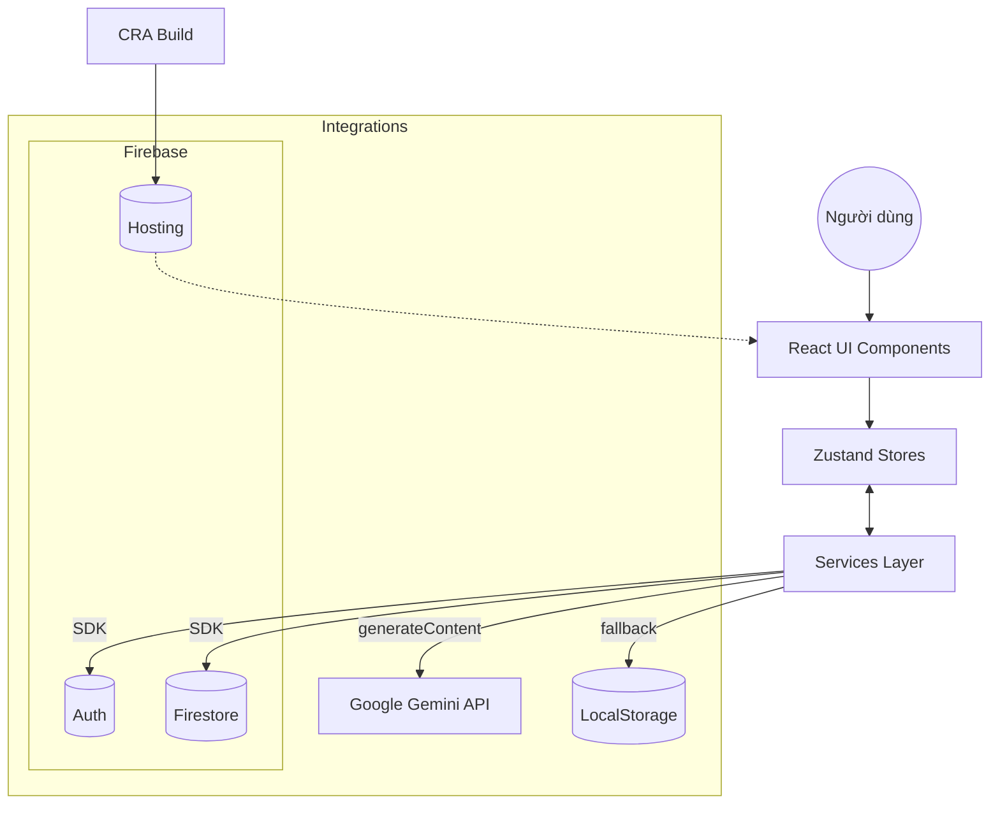
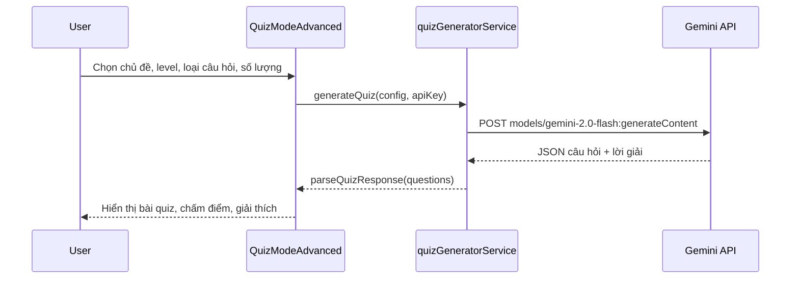
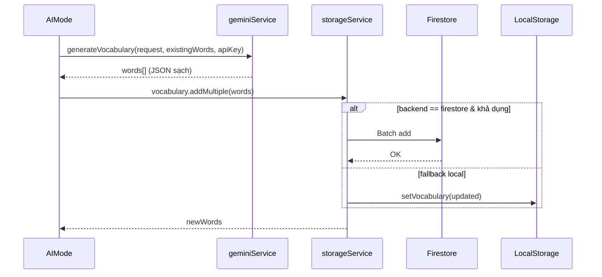

# Study English with AI — Poster (A3/A4)

Live demo: https://study-english-app-67fd9.web.app

Ngày cập nhật: 14/08/2025

## Tóm tắt dự án

Nền tảng học tiếng Anh hiện đại với hai trụ cột:
- AI Quiz Generator: Tạo đề luyện tập theo CEFR (A1–C2), nhiều dạng câu hỏi.
- Flashcards + Spaced Repetition (kiểu SM-2): Ôn tập chủ động, theo dõi tiến bộ.

Triển khai trên Firebase Hosting, đồng bộ dữ liệu qua Firestore (hoặc fallback LocalStorage). Tích hợp Google Gemini để sinh nội dung thông minh.

## Công nghệ chính

- Frontend: React 18, Zustand (state), Tailwind CSS
- AI: Google Gemini API (models: gemini-2.0-flash)
- Backend as a Service: Firebase (Auth, Firestore, Hosting)
- Build/Quality: CRA, ESLint, Prettier, Husky, lint-staged

## Kiến trúc tổng quan

Điểm nhấn:
- Lớp Services (ví dụ `quizGeneratorService`, `geminiService`, `storageService`) cô lập gọi API/SDK.
- `storageService` tự chuyển Firestore ↔ LocalStorage theo cấu hình và khả dụng.

## Luồng dữ liệu: Tạo Quiz với Gemini

Schema đầu ra (rút gọn):
- questions[]: { id, type, question, ... , correct_answer, explanation, level, points }

## Luồng dữ liệu: Sinh Từ vựng với Gemini + Lưu trữ linh hoạt

## Cấu trúc thư mục chính

- `src/features/ai` — AI mode + `geminiService.js`
- `src/features/quiz` — Quiz modes + `quizGeneratorService.js`
- `src/features/flashcard` — Flashcard study/manager/stats
- `src/features/vocab` — Quản lý từ vựng, Firestore services, initial data
- `src/shared/stores` — Zustand stores (UI, Data, Learning, Flashcard)
- `src/shared/services` — `storageService` (unified), `safeStorageService`
- `src/shared/ui` — Header, Footer, Notifications, Dialogs

## Điểm mạnh kỹ thuật

- Phân tầng rõ ràng: UI ↔ Stores ↔ Services, dễ test và thay thế backend.
- Prompt engineering chuẩn: áp ràng buộc JSON, validate & auto-fix lỗi JSON phổ biến.
- Khả năng offline/fallback: Dùng LocalStorage khi Firestore không khả dụng.
- Triển khai nhanh: CRA + Firebase Hosting.

## Bảo mật & Quyền riêng tư (gợi ý poster)

- Không commit API Key. Lưu API Key trong local (LocalStorage) theo người dùng.
- Cho phép người dùng xoá dữ liệu cục bộ (migration/clearAllData).
- Môi trường sản xuất: dùng biến môi trường `.env` cho Firebase.

## Roadmap gợi ý

- Đăng nhập người dùng (Auth) để đồng bộ đa thiết bị mặc định.
- Bộ test tự động cho Services và Stores.
- Xuất báo cáo PDF tiến độ học tập.
- Thêm chế độ luyện nghe/phát âm.

---

QR truy cập nhanh (live):

Liên hệ: maintainer@example.com
