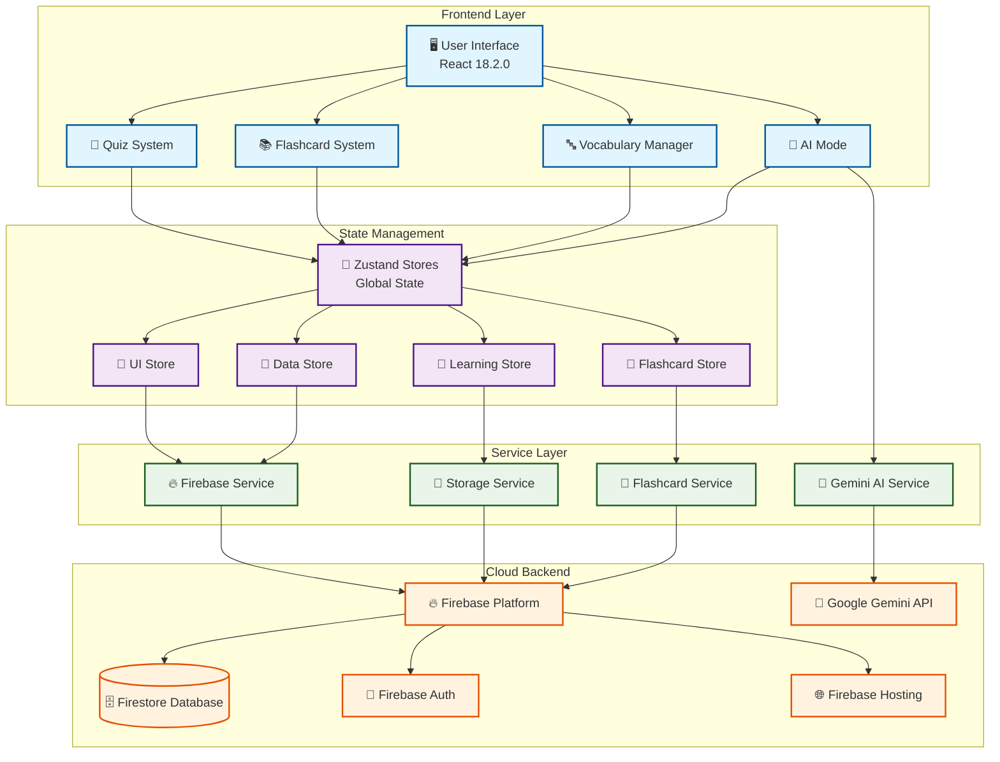
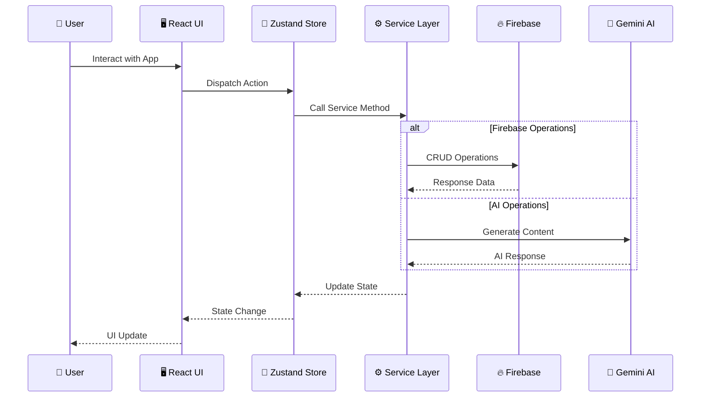
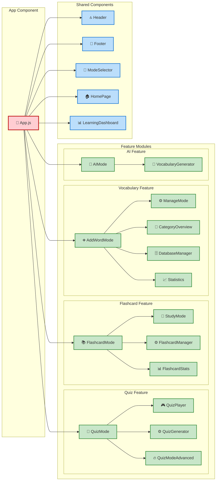
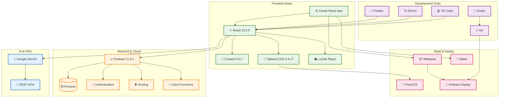
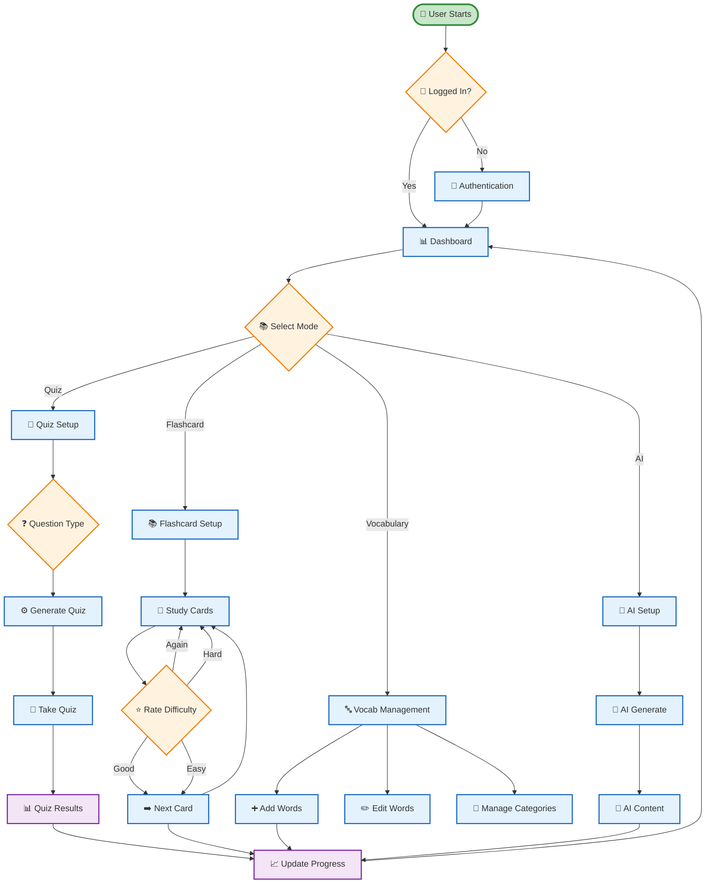

# System Architecture Diagrams

## Overall System Architecture

```mermaid
graph TB
    subgraph "Frontend Layer"
        UI[🖥️ User Interface<br/>React 18.2.0]
        Quiz[🎯 Quiz System]
        Flash[📚 Flashcard System]
        Vocab[🔤 Vocabulary Manager]
        AI[🤖 AI Mode]
    end
    
    subgraph "State Management"
        Store[🏪 Zustand Stores<br/>Global State]
        UIStore[📱 UI Store]
        DataStore[💾 Data Store]
        FlashStore[🎴 Flashcard Store]
        LearnStore[📖 Learning Store]
    end
    
    subgraph "Service Layer"
        FireService[🔥 Firebase Service]
        GeminiService[💎 Gemini AI Service]
        StorageService[💽 Storage Service]
        FlashService[🎴 Flashcard Service]
    end
    
    subgraph "Cloud Backend"
        Firebase[🔥 Firebase Platform]
        Firestore[(🗄️ Firestore Database)]
        Auth[🔐 Firebase Auth]
        Hosting[🌐 Firebase Hosting]
        Gemini[🧠 Google Gemini API]
    end
    
    UI --> Quiz
    UI --> Flash
    UI --> Vocab
    UI --> AI
    
    Quiz --> Store
    Flash --> Store
    Vocab --> Store
    AI --> Store
    
    Store --> UIStore
    Store --> DataStore
    Store --> FlashStore
    Store --> LearnStore
    
    UIStore --> FireService
    DataStore --> FireService
    FlashStore --> FlashService
    LearnStore --> StorageService
    
    AI --> GeminiService
    
    FireService --> Firebase
    GeminiService --> Gemini
    StorageService --> Firebase
    FlashService --> Firebase
    
    Firebase --> Firestore
    Firebase --> Auth
    Firebase --> Hosting
    
    classDef frontend fill:#e1f5fe,stroke:#01579b,stroke-width:2px
    classDef state fill:#f3e5f5,stroke:#4a148c,stroke-width:2px
    classDef service fill:#e8f5e8,stroke:#1b5e20,stroke-width:2px
    classDef backend fill:#fff3e0,stroke:#e65100,stroke-width:2px
    
    class UI,Quiz,Flash,Vocab,AI frontend
    class Store,UIStore,DataStore,FlashStore,LearnStore state
    class FireService,GeminiService,StorageService,FlashService service
    class Firebase,Firestore,Auth,Hosting,Gemini backend
```

## Data Flow Architecture

```mermaid
sequenceDiagram
    participant User as 👤 User
    participant UI as 🖥️ React UI
    participant Store as 🏪 Zustand Store
    participant Service as ⚙️ Service Layer
    participant Firebase as 🔥 Firebase
    participant Gemini as 🧠 Gemini AI
    
    User->>UI: Interact with App
    UI->>Store: Dispatch Action
    Store->>Service: Call Service Method
    
    alt Firebase Operations
        Service->>Firebase: CRUD Operations
        Firebase-->>Service: Response Data
    else AI Operations
        Service->>Gemini: Generate Content
        Gemini-->>Service: AI Response
    end
    
    Service-->>Store: Update State
    Store-->>UI: State Change
    UI-->>User: UI Update
```

## Component Architecture

```mermaid
graph LR
    subgraph "App Component"
        App[📱 App.js]
    end
    
    subgraph "Feature Modules"
        subgraph "Quiz Feature"
            QuizMode[🎯 QuizMode]
            QuizPlayer[🎮 QuizPlayer]
            QuizGen[⚙️ QuizGenerator]
            QuizAdv[🔥 QuizModeAdvanced]
        end
        
        subgraph "Flashcard Feature"
            FlashMode[📚 FlashcardMode]
            StudyMode[📖 StudyMode]
            FlashMgr[⚙️ FlashcardManager]
            FlashStats[📊 FlashcardStats]
        end
        
        subgraph "Vocabulary Feature"
            AddWord[➕ AddWordMode]
            ManageMode[⚙️ ManageMode]
            CategoryOv[📂 CategoryOverview]
            DBMgr[🗄️ DatabaseManager]
            Stats[📈 Statistics]
        end
        
        subgraph "AI Feature"
            AIMode[🤖 AIMode]
            VocabGen[📝 VocabularyGenerator]
        end
    end
    
    subgraph "Shared Components"
        Header[🔝 Header]
        Footer[🔻 Footer]
        ModeSelect[🔄 ModeSelector]
        HomePage[🏠 HomePage]
        Dashboard[📊 LearningDashboard]
    end
    
    App --> QuizMode
    App --> FlashMode
    App --> AddWord
    App --> AIMode
    App --> Header
    App --> Footer
    App --> ModeSelect
    App --> HomePage
    App --> Dashboard
    
    QuizMode --> QuizPlayer
    QuizMode --> QuizGen
    QuizMode --> QuizAdv
    
    FlashMode --> StudyMode
    FlashMode --> FlashMgr
    FlashMode --> FlashStats
    
    AddWord --> ManageMode
    AddWord --> CategoryOv
    AddWord --> DBMgr
    AddWord --> Stats
    
    AIMode --> VocabGen
    
    classDef app fill:#ffcdd2,stroke:#c62828,stroke-width:3px
    classDef feature fill:#c8e6c9,stroke:#388e3c,stroke-width:2px
    classDef shared fill:#bbdefb,stroke:#1976d2,stroke-width:2px
    
    class App app
    class QuizMode,QuizPlayer,QuizGen,QuizAdv,FlashMode,StudyMode,FlashMgr,FlashStats,AddWord,ManageMode,CategoryOv,DBMgr,Stats,AIMode,VocabGen feature
    class Header,Footer,ModeSelect,HomePage,Dashboard shared
```

## Technology Stack Diagram

```mermaid
graph TB
    subgraph "Development Tools"
        VSCode[💻 VS Code]
        Git[📂 Git]
        ESLint[🔍 ESLint]
        Prettier[💄 Prettier]
        Husky[🐺 Husky]
    end
    
    subgraph "Frontend Stack"
        React[⚛️ React 18.2.0]
        Zustand[🏪 Zustand 5.0.7]
        Tailwind[🎨 Tailwind CSS 3.4.17]
        Lucide[🎭 Lucide React]
        CRA[⚙️ Create React App]
    end
    
    subgraph "Backend & Cloud"
        Firebase[🔥 Firebase 11.9.1]
        Firestore[(🗄️ Firestore)]
        Auth[🔐 Authentication]
        Hosting[🌐 Hosting]
        Functions[⚡ Cloud Functions]
    end
    
    subgraph "AI & APIs"
        Gemini[🧠 Google Gemini]
        API[🔗 REST APIs]
    end
    
    subgraph "Build & Deploy"
        Webpack[📦 Webpack]
        Babel[🔄 Babel]
        PostCSS[🎯 PostCSS]
        Deploy[🚀 Firebase Deploy]
    end
    
    VSCode --> React
    Git --> Deploy
    ESLint --> React
    Prettier --> React
    Husky --> Git
    
    React --> Zustand
    React --> Tailwind
    React --> Lucide
    CRA --> React
    
    React --> Firebase
    Firebase --> Firestore
    Firebase --> Auth
    Firebase --> Hosting
    Firebase --> Functions
    
    React --> Gemini
    Gemini --> API
    
    CRA --> Webpack
    CRA --> Babel
    Tailwind --> PostCSS
    Webpack --> Deploy
    
    classDef tools fill:#f3e5f5,stroke:#7b1fa2,stroke-width:2px
    classDef frontend fill:#e8f5e8,stroke:#2e7d32,stroke-width:2px
    classDef backend fill:#fff3e0,stroke:#f57c00,stroke-width:2px
    classDef ai fill:#e3f2fd,stroke:#1565c0,stroke-width:2px
    classDef build fill:#fce4ec,stroke:#c2185b,stroke-width:2px
    
    class VSCode,Git,ESLint,Prettier,Husky tools
    class React,Zustand,Tailwind,Lucide,CRA frontend
    class Firebase,Firestore,Auth,Hosting,Functions backend
    class Gemini,API ai
    class Webpack,Babel,PostCSS,Deploy build
```

## Learning Flow Diagram

```mermaid
graph TD
    Start([👤 User Starts]) --> Login{🔐 Logged In?}
    Login -->|No| Auth[🔑 Authentication]
    Login -->|Yes| Dashboard[📊 Dashboard]
    Auth --> Dashboard
    
    Dashboard --> Mode{📚 Select Mode}
    
    Mode -->|Quiz| QuizSetup[🎯 Quiz Setup]
    Mode -->|Flashcard| FlashSetup[📚 Flashcard Setup]
    Mode -->|Vocabulary| VocabMgmt[🔤 Vocab Management]
    Mode -->|AI| AISetup[🤖 AI Setup]
    
    QuizSetup --> QuizType{❓ Question Type}
    QuizType --> Generate[⚙️ Generate Quiz]
    Generate --> TakeQuiz[📝 Take Quiz]
    TakeQuiz --> QuizResult[📊 Quiz Results]
    
    FlashSetup --> StudyCards[📖 Study Cards]
    StudyCards --> Rate{⭐ Rate Difficulty}
    Rate -->|Again| StudyCards
    Rate -->|Hard| StudyCards
    Rate -->|Good| NextCard[➡️ Next Card]
    Rate -->|Easy| NextCard
    NextCard --> StudyCards
    
    VocabMgmt --> AddWords[➕ Add Words]
    VocabMgmt --> EditWords[✏️ Edit Words]
    VocabMgmt --> Categories[📂 Manage Categories]
    
    AISetup --> AIGenerate[🧠 AI Generate]
    AIGenerate --> AIContent[📝 AI Content]
    
    QuizResult --> Progress[📈 Update Progress]
    NextCard --> Progress
    AddWords --> Progress
    AIContent --> Progress
    
    Progress --> Dashboard
    
    classDef start fill:#c8e6c9,stroke:#388e3c,stroke-width:3px
    classDef decision fill:#fff3e0,stroke:#f57c00,stroke-width:2px
    classDef process fill:#e3f2fd,stroke:#1565c0,stroke-width:2px
    classDef result fill:#f3e5f5,stroke:#7b1fa2,stroke-width:2px
    
    class Start start
    class Login,Mode,QuizType,Rate decision
    class Auth,Dashboard,QuizSetup,FlashSetup,VocabMgmt,AISetup,Generate,TakeQuiz,StudyCards,NextCard,AddWords,EditWords,Categories,AIGenerate,AIContent process
    class QuizResult,Progress result
```
